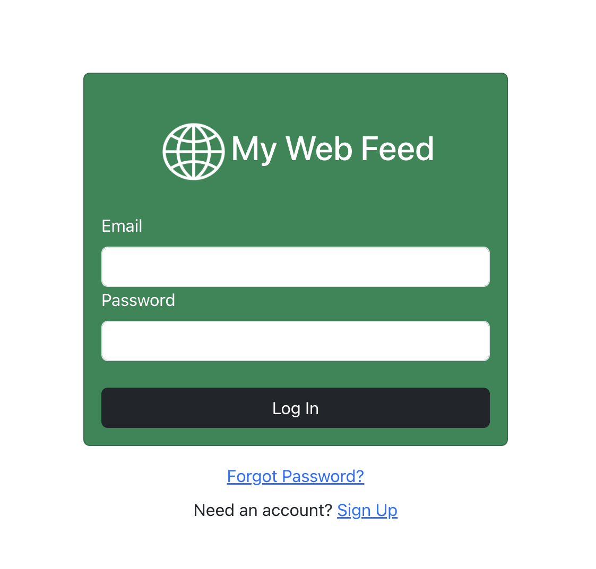
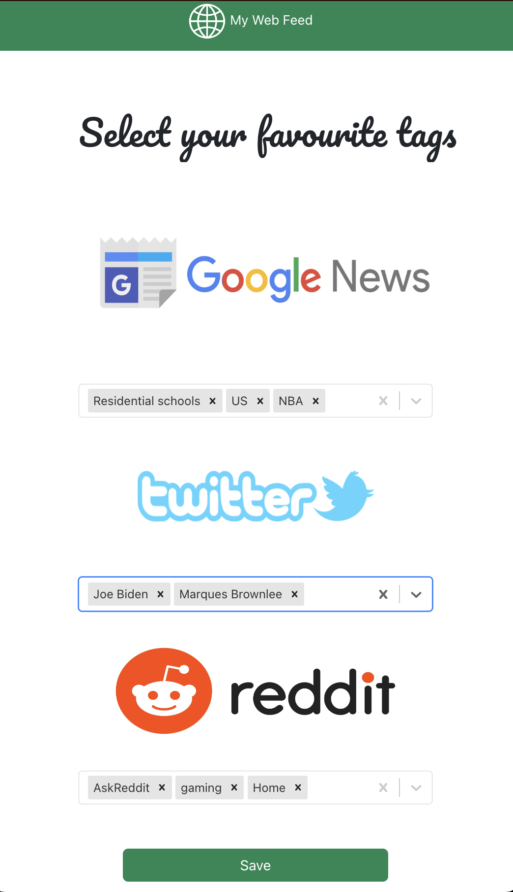

# My Web Feed

The platform brings together content from Google News, Reddit, and Twitter, to provide users with a personalized feed. Users can set their preferences and keywords to filter the content according to their interests.

## Features

- Secure Authentication: Authenticate users securely.
  
- Personalized Feed: Set preferences and keywords to tailor the feed to your interests.
  
- Aggregated Content: Access content from Google News, Reddit, and Twitter in one place.
  

## Setup

Ensure you have the following installed on your system:

- [Docker](https://www.docker.com/)
- [Node.js](https://nodejs.org/)
- [MongoDB](https://www.mongodb.com/)

### Installation

1. Clone this repository to your local machine.
2. Navigate to the project directory.

### Setup Backend and Frontend

To set up both backend and frontend simultaneously, execute the following command:

```bash
make start
```

This command will initialize both the backend and frontend services, including Docker containers for backend services and starting the frontend server.

## Usage

1. Sign in to your account or create a new one.
2. Set your preferences and keywords to customize your feed.
3. Explore your personalized feed with content from Google News, Reddit, and Twitter.
4. Update your preferences and keywords as needed to refine your feed.

## Environment Variables

Ensure you have a `.env` file in the project directory.

## Contribution

Contributions are welcome! If you have any suggestions, ideas, or improvements, feel free to open an issue or create a pull request.

## License

This project is licensed under the [MIT License](LICENSE). Feel free to use, modify, and distribute it as per the terms of the license.
